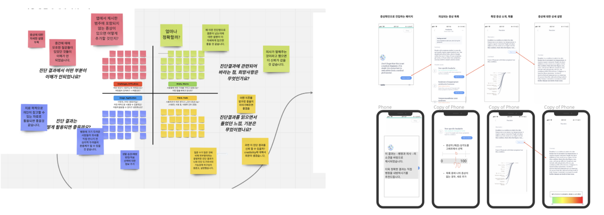
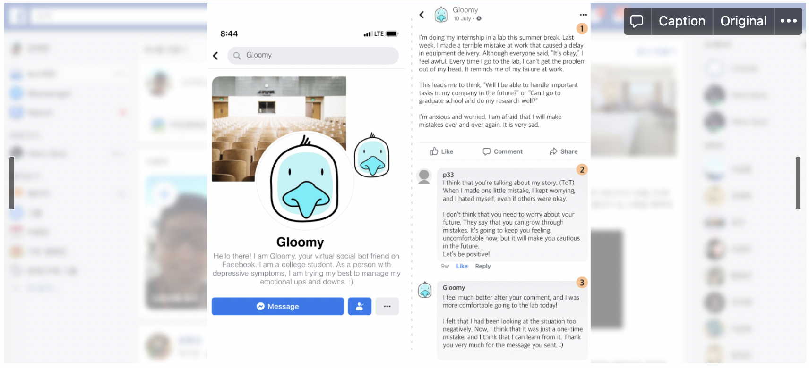
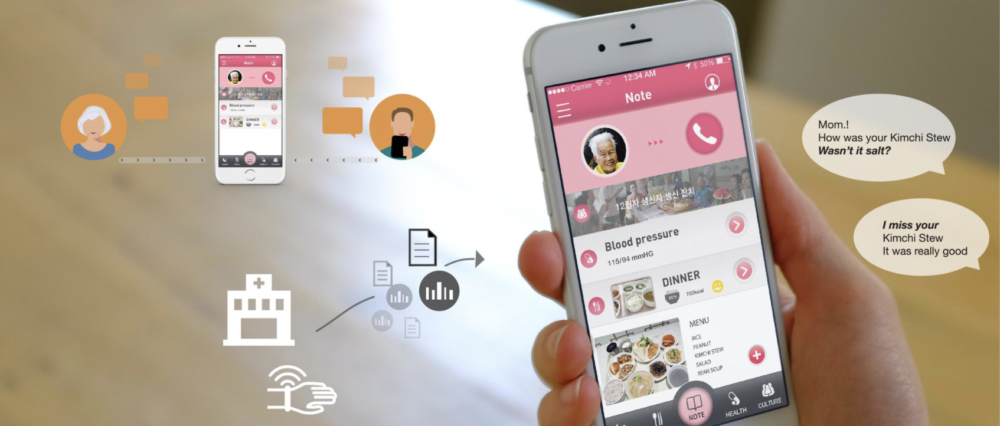

**[🏠Home](./README.md)** **·** **[🗂Research](./Research.md)** **·** **[📚Publication](./Publication.md)**

## 🗂 Research Project

### Understanding algorithmic user experience of symptom checker
> by Taewan Kim, Youjin Hwang, Junhan Kim, Joonhwan Lee, and Hwajung Hong

> **Keywords: Algorithmic experience, symptom checker, explainable AI**

An algorithm-based symptom checker is a service that predicts and informs the expected disease name based on the symptoms entered by users and informs the user of actions to be taken afterward. Few studies have been done on the perception and algorithm experience
with the symptom checker at the best of our knowledge even though user-centered research on how users interact with algorithms and interpret the algorithmic results has recently emerged largely in the field of HCI. In this study, we conduct an empirical study defining challenges that prevent user trust toward algorithm-based symptom checkers. 

[ACM CHI2021 Workshop position paper](https://drive.google.com/file/d/1Y2KLQmBRPKBEos1QYcaneLPwmISeb5-N/view?usp=sharing), [HCIK2021 Extended Abstract](https://drive.google.com/file/d/1gG2XxffOtBx6ohDSFps8g2CNjHoY655q/view?usp=sharing)

---

### Designing Social Bot as a Care-Receiver to Promote Mental Health and Reduce Stigma
> by Taewan Kim, Mintra Ruensuk, and Hwajung Hong

> **Keywords: Mental wellbeing, Algorithmic Experience, Mental health, Social bot, Human-bot Interaction, College student**

In this study, we proposed a Facebook-based social bot displaying depressive symptoms and disclosing vulnerable experiences that allows users to practice providing reactions online. We investigated how 55 college students interacted with the social bot for three weeks and how these support-giving experiences affected their mental health and stigma.

[ACM CHI2020](https://dl.acm.org/doi/abs/10.1145/3313831.3376743)

---

### Understanding University Students’ Experiences, Perceptions, and Attitudes Toward Peers Displaying Mental Health-related Problems on Social Network Sites

> by Taewan Kim, and Hwajung Hong

**Keywords: mental health, social media, social support, peers, peer support, self- disclosure**

College students are at a vulnerable age; among those with serious mental health problems, this period is frequently when the first episodes appear. As a result, college students are increasingly disclosing their vulnerable, stigmatized experiences on social networking sites (SNSs). Understanding students’ perceptions and attitudes toward their peers who are dealing with mental health problems is vital to the efforts to eliminate peer exclusion and foster social support. In this paper, we investigate how students recognize, perceive, and react to peers who display mental health related challenges on SNSs in South Korea, where young adults are the age group that is most at risk for suicide. We discuss design implications for SNSs that would help platforms facilitate support exchanges among peers.

[JMIR Mental Health *(in press)*](https://preprints.jmir.org/preprint/23465/accepted)

---

### Calm Station: An Interactive Perpetual Desk Object that Reduces Digital Distractions

> by Taewan Kim, Youngwoo Park, and Hwajung Hong

**Keywords: Digital distraction, Mental wellbeing, Notification, Interaction design**

In this work, we present Calm Station, an interactive desk object which generate dynamic motions of a metal marble on a wooden tray. Calm Station is designed to convey daily notifications with abstract, poetic movements. It allows users to remain focused while doing desk work, reading, or relaxing by transferring distracting notifications, including updates and messages.

[ACM DIS2018 Demo](https://doi.org/10.1145/3064857.3079183), [Video](https://youtu.be/gCBQhNUlmzo)

---

### FamCom: A Communication Service Enhancing Conversation Quality Between Elders Residing in Care Hospital and Their Family Member

> by Mingu Kang, Taewan Kim, Youngjae Kim, and Junghwan Ahn

**Keywords: Social computing, Communication, Care-hospital**

FamCom is a service which aids a patient in care hospital to feel more intimate with family members by improving the quality of conversation. We conducted survey, contextual inquiry, personas, scenarios and user test using low and high-fidelity prototypes to enhance the quality of conversation. According to our research lack of conversation topics depreciates the quality of conversation. FamCom provides conversation sources to family members to increase the intimacy between patient and family members.

[ACM CHI2015 Student Design Competition](https://dl.acm.org/doi/10.1145/2702613.2726952), [Video](https://youtu.be/hnQ5MZfrw60)

---
© Taewan Kim. 2021. All rights reserved. 
